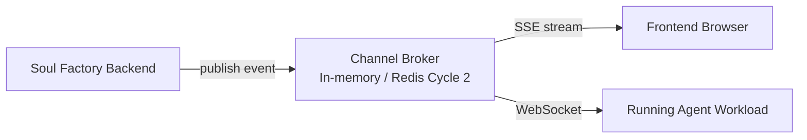
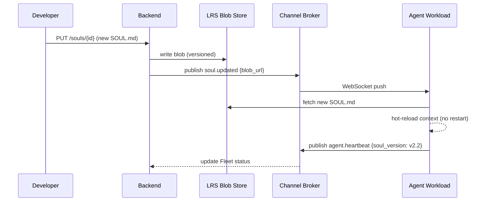

# Heartbeat & Channels

Soul Factory uses a lightweight pub/sub system to keep all UI clients and running agents in sync without polling. This powers soul hot-swap, skill live-attach, and HITL notifications.

---

## Architecture



---

## Heartbeat

Every running agent sends a **heartbeat** to the backend every **10 seconds**:

```json
{
  "type": "heartbeat",
  "agent_id": "wl_abc123",
  "status": "RUNNING",
  "active_sessions": 2,
  "soul_version": "v2.1",
  "ts": "2026-04-09T09:15:00Z"
}
```

If the backend misses 3 consecutive heartbeats (30 s) it marks the agent `UNREACHABLE` on the Fleet page.

---

## Event types

| Event | Publisher | Subscribers | Payload |
|---|---|---|---|
| `agent.heartbeat` | Agent workload | Backend, Fleet UI | Status, session count |
| `soul.updated` | Backend (on LRS write) | Agent workload | New soul blob URL |
| `skill.attached` | Backend (on API call) | Agent workload | Skill manifest |
| `skill.detached` | Backend | Agent workload | Skill ID |
| `hitl.triggered` | Agent workload | Backend, HITL UI | Item ID, context |
| `hitl.resolved` | Backend (on user action) | Agent workload | Resolution + note |
| `session.started` | Agent workload | Backend (LRS write) | Session ID, user |
| `session.ended` | Agent workload | Backend | Session ID, stats |

---

## Soul hot-swap

When a developer pushes a new SOUL.md (via UI or GitHub PR):



The entire swap takes ~2–3 seconds with zero downtime — active sessions continue with the new soul from the next message.

---

## Frontend SSE stream

The frontend subscribes to a per-tab SSE endpoint:

```
GET /events/stream?agent_id=wl_abc123
Accept: text/event-stream
```

Events received:

```
event: agent.heartbeat
data: {"status":"RUNNING","soul_version":"v2.2"}

event: hitl.triggered
data: {"item_id":"hitl_xyz","action":"deploy_model"}
```

---

## Cycle 1 vs Cycle 2

| Feature | Cycle 1 | Cycle 2 |
|---|---|---|
| Agent heartbeat | Mock polling | Real WebSocket from workload |
| Soul hot-swap | Manual restart required | Zero-downtime channel push |
| Skill live-attach | Requires restart | Hot-attach via channel |
| HITL notifications | In-app only | Email + Slack via channel events |
| Channel broker | In-memory | Redis Pub/Sub |

---

## What's next

<div class="next-steps" markdown>
<a class="next-step-card" href="../multiagent/">
  <div class="next-step-card-title">Multi-agent</div>
  <div class="next-step-card-desc">Use channels for cross-agent coordination.</div>
</a>
<a class="next-step-card" href="../../reference/cycle-2/">
  <div class="next-step-card-title">Cycle 2 Roadmap</div>
  <div class="next-step-card-desc">Full channel/heartbeat implementation timeline.</div>
</a>
</div>

<div class="sf-helpful">
  <span class="sf-helpful-label">Was this page helpful?</span>
  <button class="sf-helpful-btn">👍 Yes</button>
  <button class="sf-helpful-btn">👎 No</button>
</div>
