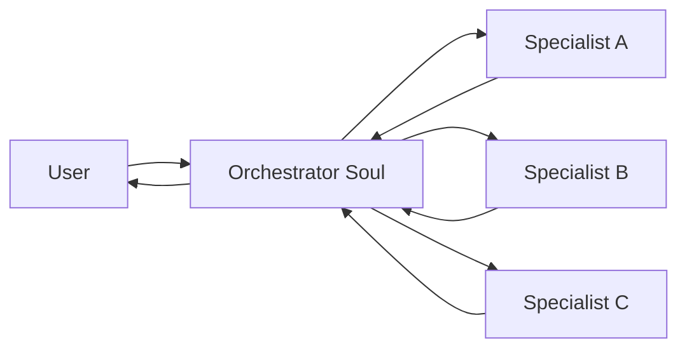
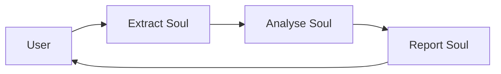

# Multi-agent

Soul Factory supports multi-agent patterns where one orchestrator agent delegates tasks to specialist sub-agents, aggregates results, and presents a unified response to the user.

---

## When to use multi-agent

| Scenario | Example |
|---|---|
| **Parallelism** | Run data analysis + report generation simultaneously |
| **Specialisation** | Route coding questions to `code-review`, data questions to `data-analyst` |
| **Long-horizon tasks** | Break a 50-step workflow into coordinated sub-tasks |
| **Cost optimisation** | Use a cheap small model for triage, expensive model only for synthesis |

---

## Orchestration patterns

### Fan-out / Fan-in



The orchestrator dispatches sub-tasks in parallel, waits for results, and synthesises.

### Sequential pipeline



Each soul receives the previous soul's output as its input context.

---

## Wiring sub-agents via MCP

Soul Factory exposes an MCP tool `sf_invoke_agent` that lets any soul call another:

```json
{
  "name": "sf_invoke_agent",
  "description": "Invoke another Soul Factory agent and return its response",
  "inputSchema": {
    "type": "object",
    "properties": {
      "agent_name": {"type": "string"},
      "prompt": {"type": "string"},
      "timeout_s": {"type": "number", "default": 60}
    },
    "required": ["agent_name", "prompt"]
  }
}
```

Usage in a SOUL.md:

```markdown
## Tools
- sf_invoke_agent: Use this to delegate data analysis tasks to `data-analyst`.
  Pass the user's question verbatim. Synthesise the returned result.
```

---

## Session scoping

Each sub-agent invocation creates a new **child session** linked to the parent:

```
parent_session: sess_abc123
  └─ child_session: sess_def456  (agent: data-analyst)
  └─ child_session: sess_ghi789  (agent: code-review)
```

Child session logs appear in the parent agent's log view with a `[delegated]` tag.

---

## Cost attribution

Multi-agent cost is attributed per session. The orchestrator's Cost tab shows:

- Its own LLM calls
- A roll-up of costs from all child sessions it spawned

---

## HITL in multi-agent

If a sub-agent triggers HITL, the orchestrator pauses at that delegation step. The HITL Queue shows the parent agent as the pending item, with context showing it was waiting on a sub-agent.

---

## What's next

<div class="next-steps" markdown>
<a class="next-step-card" href="../heartbeat-channels/">
  <div class="next-step-card-title">Heartbeat & Channels</div>
  <div class="next-step-card-desc">How agents communicate state changes in real time.</div>
</a>
<a class="next-step-card" href="../../build/soul-reference/">
  <div class="next-step-card-title">Soul Reference</div>
  <div class="next-step-card-desc">Write an orchestrator SOUL.md with delegation instructions.</div>
</a>
</div>

<div class="sf-helpful">
  <span class="sf-helpful-label">Was this page helpful?</span>
  <button class="sf-helpful-btn">👍 Yes</button>
  <button class="sf-helpful-btn">👎 No</button>
</div>
