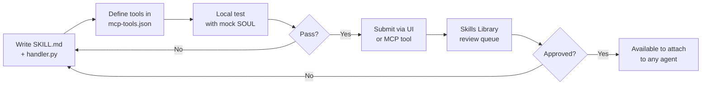

# Skills Pipeline

The full lifecycle for creating, testing, and publishing a Soul Factory skill — from an empty folder to a live tool available to any agent.

---

## Pipeline overview



---

## Step 1 — Scaffold the skill

```bash
mkdir -p skills/my-skill
cd skills/my-skill
touch SKILL.md handler.py mcp-tools.json
```

---

## Step 2 — Write SKILL.md

```markdown
# My Skill

**Purpose**: One-sentence description of what this skill does.

## Inputs
- `query` (string, required): The question to answer.

## Outputs
Returns a string with the result.

## Examples

### Example 1
Input: `query="What is the status of deployment xyz?"`
Output: `"Deployment xyz is RUNNING as of 09:14 UTC"`

## Notes
- Requires DR API access.
- Rate-limited to 10 calls/minute.
```

---

## Step 3 — Write `mcp-tools.json`

```json
[
  {
    "name": "my_skill_lookup",
    "description": "Look up X and return Y. Use when the user asks about Z.",
    "inputSchema": {
      "type": "object",
      "properties": {
        "query": {
          "type": "string",
          "description": "The question to answer"
        }
      },
      "required": ["query"]
    }
  }
]
```

---

## Step 4 — Write `handler.py`

```python
async def my_skill_lookup(query: str) -> str:
    """
    Implement your skill logic here.
    Return a plain string — the SOUL will use this as tool context.
    """
    # call external API, DR API, etc.
    result = await fetch_something(query)
    return str(result)
```

---

## Step 5 — Local test

Use the Soul Factory test harness:

```bash
python -m pytest skills/my-skill/test_handler.py -v
```

Or run an interactive test against a local SOUL:

```bash
python scripts/test_skill.py \
  --skill skills/my-skill \
  --soul souls/nemoclaw/SOUL.md \
  --prompt "What is the status of my deployments?"
```

---

## Step 6 — Submit

=== "Via the UI"

    1. Navigate to **Run Agents → Skills Library**.
    2. Click **+ New Skill**.
    3. Upload the skill folder (zipped) or paste a Git URL.
    4. Fill in category, tags, access level.
    5. Click **Submit for Review**.

=== "Via MCP tool"

    ```
    Tool: sf_submit_skill
    Args:
      name: "my-skill"
      git_url: "https://github.com/your-org/dr-claw/tree/main/skills/my-skill"
      description: "One-line description"
      category: "data"
    ```

---

## Step 7 — Review & publish

| Review stage | Who | What they check |
|---|---|---|
| Automated | CI | handler.py syntax, mcp-tools.json schema validity |
| Manual | Skill maintainer | Security, scope, naming conventions |
| Publish | Admin | Available in Skills Library for attachment |

---

## Best practices

- **One tool per skill** unless tools are tightly coupled.
- **Write for the SOUL** — the `description` in `mcp-tools.json` is what the LLM reads. Be precise and include when to use vs not use the tool.
- **Idempotent handlers** — skills may be called multiple times in a session.
- **Return strings** — complex objects should be JSON-serialised to a string.
- **Error handling** — raise a descriptive `SkillError` rather than returning empty strings.

---

## What's next

<div class="next-steps" markdown>
<a class="next-step-card" href="../../build/soul-reference/">
  <div class="next-step-card-title">Soul Reference</div>
  <div class="next-step-card-desc">Wire your new skill into a SOUL.md.</div>
</a>
<a class="next-step-card" href="../../connect/mcp-tools/">
  <div class="next-step-card-title">MCP Tools</div>
  <div class="next-step-card-desc">See which tools already exist before writing a duplicate.</div>
</a>
</div>

<div class="sf-helpful">
  <span class="sf-helpful-label">Was this page helpful?</span>
  <button class="sf-helpful-btn">👍 Yes</button>
  <button class="sf-helpful-btn">👎 No</button>
</div>
