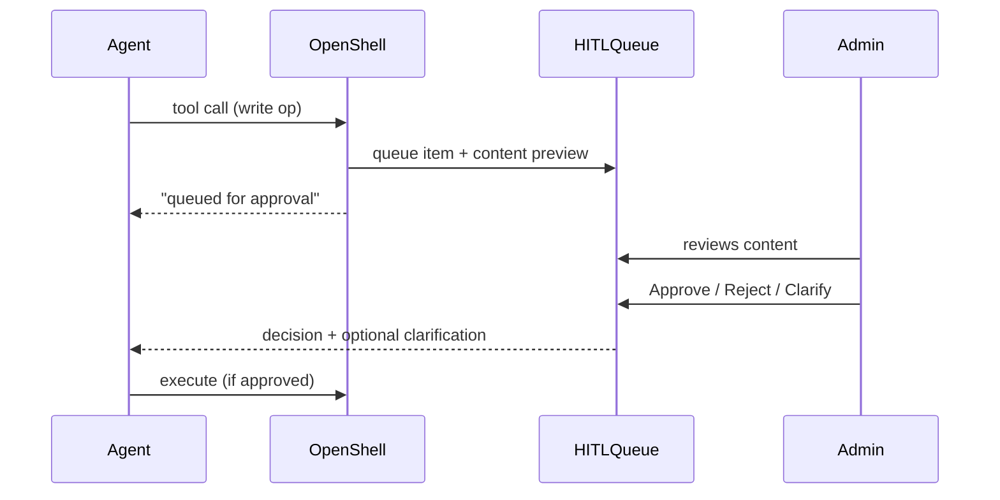

# Core Concepts

Soul Factory is built on six concepts. Understanding these makes every other page click.

---

## The Six Concepts

| Concept | Description |
|---------|-------------|
| **Pack** | Role-based agent template — pre-configured soul + default tools for a specific job |
| **Soul** | The agent's identity — a `SOUL.md` file the runtime reads on every request |
| **Domain** | The active soul configuration, hot-swappable via `souls/.active` with no restart |
| **Session** | A running agent instance — chat history, SSE log stream, tool calls, HITL events |
| **HITL** | Human-in-the-loop gate — write operations held for admin review before execution |
| **OpenShell** | Envoy-based tool firewall — every tool call is allowed, blocked, or queued and logged |

---

## Pack

A pack is a pre-built agent template for a specific role. It bundles:

- A `SOUL.md` persona tuned for that role's job
- A default tool set from the Global MCP catalog
- A killer use case (shown on the catalog card)
- A pack ID used to deploy the agent

**Six internal packs ship in Cycle 1:**

| Pack | Role | Killer use case |
|------|------|-----------------|
| CFDS Agent | Customer-facing data science | *"Prep me for my next customer meeting"* |
| Eng Productivity | Engineering | *"What's broken right now?"* |
| Executive | Leadership | *"Give me this week's business pulse"* |
| Sales | Sales | *"Find me warm leads in my pipeline"* |
| Product Manager | Product | *"What did users say about this feature?"* |
| Docs Writer | Content | *"Draft release notes from this diff"* |

Plus three customer packs: Data Analyst, Docs RAG, Supply Chain.

---

## Soul (SOUL.md)

The soul is the agent's system prompt — but structured, not freeform. It lives in:

```
souls/
  <soul-name>/
    SOUL.md          ← persona, capabilities, routing, domain context
    mcp-tools.json   ← tool allowlist
  .active            ← one line: active soul name
```

**The runtime re-reads these files on every request.** No restart, no redeploy. This means:

- Edit `SOUL.md` in the Soul Editor tab → the agent picks it up on the next message
- Activate a different soul via the Domain Packs tab → takes effect immediately

See [Soul Reference](../build/soul-reference.md) for the full format spec.

---

## Domain

A domain is a deployed soul configuration. When a user switches domain packs from the Agent Detail tab, the system:

1. POSTs the new pack's `SOUL.md` content to `/admin/config`
2. nemoclaw writes `souls/.active` to point to the new soul
3. The next request to the agent uses the new configuration

Domains let one agent binary serve multiple personas without redeployment.

---

## Session

A session is a running conversation with an agent. Each session has:

- **Chat history** — all messages, tool calls, and results
- **SSE log stream** — real-time structured events from Envoy
- **HITL events** — any write operations pending approval
- **Agent isolation** — switching agents in the UI remounts the component (`key={agent.id}`), preventing state bleed

In the UI, each agent in My Agents has its own session. The Deep-Coder pack supports multi-session (multiple parallel conversations).

---

## HITL — Human in the Loop

When an agent wants to execute a write operation (create a note, send an email, modify a file), OpenShell can queue it for admin review instead of executing immediately.

**HITL flow:**



Every approval and rejection is written to the **audit trail** with who decided, when, and why.

---

## OpenShell

OpenShell is the Envoy-based proxy that sits between the agent and every tool call. Every call goes through it — there are no direct tool calls.

**What OpenShell does:**

| Event type | What it means |
|------------|---------------|
| `ALLOW` | Tool call permitted and executed |
| `BLOCK` | Tool call denied — not in the agent's `mcp-tools.json` allowlist, or IP filtered |
| `LLM` | LLM call made — model, token count, cost, latency logged |
| `HITL` | Write operation queued for admin approval |
| `CRON` | Scheduled job triggered |

Every event is emitted as a structured SSE event, visible in the **Logs** page and **Agent Detail → Logs** tab. Admins can filter by event type and detect patterns across the fleet.

!!! tip "Why this matters"
    A BLOCK event on Fleet is not a failure — it's the system working. An agent attempted something outside its approved tool set and was contained. The admin sees it, logs it, and can decide whether to expand the allowlist.
