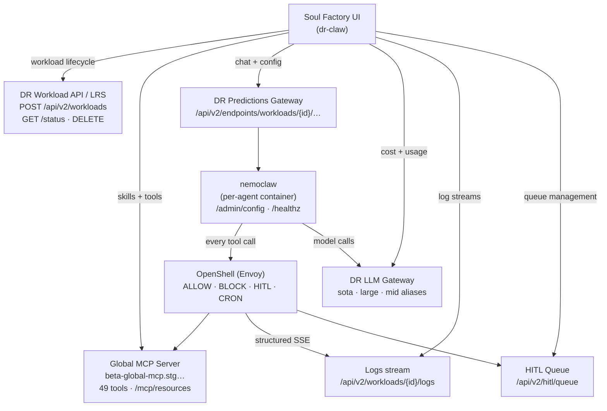

# Architecture

## User Roles

Two roles share the same surface. Console nav items are hidden for non-admins — no explicit role selection is needed.

| Role | Sees |
|------|------|
| **End user** | Catalog, My Agents, Skills |
| **Admin / Operator** | Everything above + Fleet, Logs, HITL Queue, Cost & Usage |

Role is determined by DR platform permissions.

---

## System Diagram

---

## User Journeys

### Journey 1 — Non-technical user launching their first agent

User opens Agents → Catalog. Sees a grid of pack cards organized by role. Each card has one line that speaks directly to their job — *"Prep me for my next customer meeting"* for CFDS, *"What's broken right now?"* for eng. No jargon, no configuration visible yet.

They click **Launch** on the CFDS pack. Configure page appears — four fields: role, team, DR API token, interface. Nothing else.

Launching page animates through five steps automatically — pulling SOUL.md, wiring gateway, connecting MCP, health check, live. The final step flips to mint green with *"live."* A URL appears.

They click **Open agent** → they're in the web UI or Slack talking to their agent.

From **My Agents** they can see their agent is running, token usage, last active, and tool access. They can pause or stop it.

---

### Journey 2 — Developer forking the runtime

Same launch flow. But after the agent goes live, a secondary CTA appears — **"Get the repo."**

Get the Repo page shows exactly what they're getting: SOUL.md pre-configured, `.env.template` pre-filled, OPENCLAW-AGENT.md, `task dev` command. They enter their GitHub handle, click **Connect GitHub and fork**.

They clone locally, run `task dev`, NullClaw boots in under 200ms — an exact mirror of their production agent in under 5 minutes.

They add a new tool: write the SKILL.md and mcp-tools.json entry, push through the skills pipeline. The **Skills** page shows the pipeline progress — submitted → validating → e2e → pending approval → promoted to Global MCP.

---

### Journey 3 — Admin governing the fleet

Admin opens **Fleet**. Sees all running agents across the org — owner, pack, token count, anomaly flags.

They click an anomaly flag → jumps to that agent's detail log view, scrolled to the anomaly event. They see a BLOCK event — `salesforce.api` was attempted, not in approved tool list, IP filtered by OpenShell. Logged and contained.

They go to **HITL Queue**. Three pending write operations. They approve two, reject one. The rejected agent receives the rejection and logs it. The audit trail records who rejected, when, and why.

They go to **Integration Governance**. One pending Salesforce integration. They review the SKILL.md, see e2e tests passed, approve it → promotes to Global MCP.

They go to **Cost & Usage**. Monthly spend tracking 40% over budget. The supply chain agent is responsible for 60% of sota model usage. They navigate to that agent's Tools tab to see which tools are triggering expensive LLM calls.

---

### Journey 4 — Always-on reactive agent (no user interaction)

6am UTC. Cron fires on the eng-productivity agent. Agent wakes, runs the daily CVE scan, posts a formatted summary to `#eng-security`. No human initiated this.

A GitHub PR is opened. Webhook fires to the eng-productivity agent. Agent reads the PR diff, checks for CVEs, nudges the reviewer, posts a triage comment in under 30 seconds.

In **Logs** the admin can see both events — full trace, full audit. The agent acted autonomously and every action is visible.

---

## Integration Points

### Global MCP
**Base URL:** `https://beta-global-mcp.stg.ue1.aws.int.datarobot.com/mcp`

Source of truth for tools, skills, and integrations. Every UI surface that touches tools reads from or writes to this server.

### DR Workload API / LRS
Agent lifecycle — launch, monitor, pause, stop. See [API Reference](../connect/api-reference.md).

### DR LLM Gateway
Routes all model calls through `sota`, `large`, and `mid` aliases. The UI reads cost and token data — it doesn't call the gateway directly.

### Envoy / OpenShell
Streaming logs for Agent Detail and Logs pages. Every tool call event (`ALLOW`, `BLOCK`, `LLM`, `HITL`, `CRON`) emitted as structured SSE.

---

## Domain Pack Catalog

| Pack | Category | Default tool count |
|------|----------|--------------------|
| CFDS Agent | Internal | 8 |
| Eng Productivity | Internal | 7 |
| Executive | Internal | 5 |
| Sales | Internal | 6 |
| Product Manager | Internal | 6 |
| Docs Writer | Internal | 7 |
| Data Analyst | Customer | 13 |
| Docs RAG | Customer | 8 |
| Supply Chain | Customer | 13 |

See [MCP Tools](../connect/mcp-tools.md) for the full tool catalog and SOUL→tool mappings.
