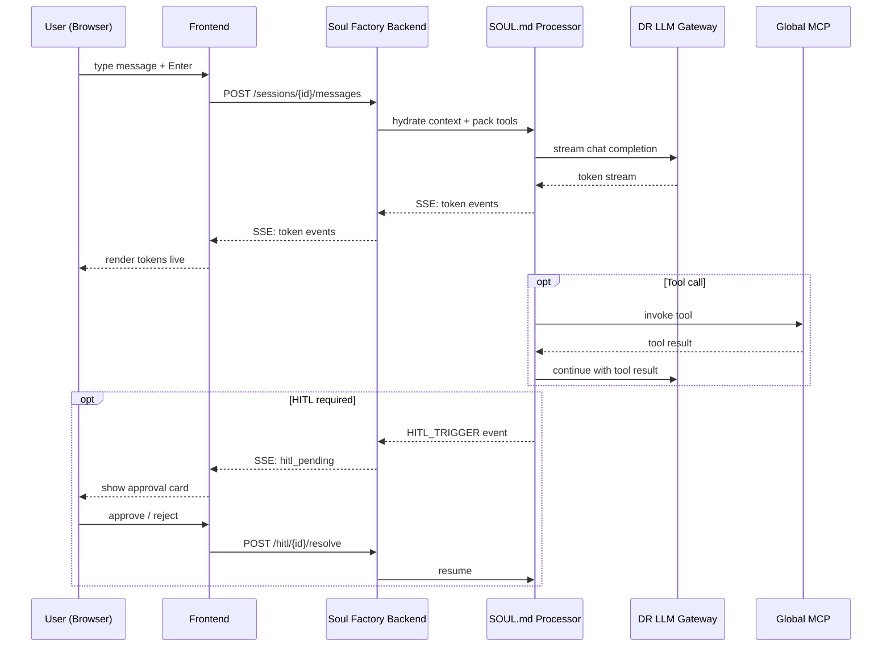

# Chat

The Chat tab is a live SSE (Server-Sent Events) interface to your agent. Messages stream token-by-token from the LLM, tool calls are displayed inline, and HITL pauses are surfaced as approval cards.

---

## Message lifecycle



---

## SSE event types

| Event | Payload | What happens |
|---|---|---|
| `token` | `{text: "..."}` | Appended to current message bubble |
| `tool_call` | `{name, args}` | Tool call card expands inline |
| `tool_result` | `{name, result}` | Result appended to tool card |
| `hitl_pending` | `{id, action, context}` | Approval card shown; chat pauses |
| `error` | `{code, message}` | Error banner in chat |
| `done` | `{total_tokens, cost_usd}` | Message bubble finalised |

---

## UI features

### Message types

| Type | Appearance |
|---|---|
| **User** | Right-aligned, gray bubble |
| **Assistant** | Left-aligned, dark bubble, streaming cursor |
| **Tool call** | Collapsible card: tool name + args → result |
| **HITL pause** | Amber card with Approve / Reject buttons |
| **System** | Centered gray caption |

### Keyboard shortcuts

| Key | Action |
|---|---|
| `Enter` | Send message |
| `Shift+Enter` | Newline in input |
| `⌘K` | Clear current session |
| `⌘/` | Focus input |

---

## Session persistence

Each chat window maps to a **Session** in LRS. Sessions are scoped per user × agent and persist history across page reloads.

To start a fresh session, click **New Chat** (top-right of the chat panel).

---

## Tool call rendering

When the SOUL invokes an MCP tool, a collapsible card appears:

```
▶ tool_call  dr_list_deployments
  args: {"status": "RUNNING", "limit": 10}
  ─────────────────────────────
  result: [{...}, {...}]          ← expands on click
```

---

## What's next

<div class="next-steps" markdown>
<a class="next-step-card" href="../skills/">
  <div class="next-step-card-title">Skills</div>
  <div class="next-step-card-desc">Extend what your agent can do with custom skills.</div>
</a>
<a class="next-step-card" href="../../govern/hitl-queue/">
  <div class="next-step-card-title">HITL Queue</div>
  <div class="next-step-card-desc">Manage pending human approvals across all agents.</div>
</a>
<a class="next-step-card" href="../../build/app-flow/">
  <div class="next-step-card-title">App Flow</div>
  <div class="next-step-card-desc">Full sequence diagrams for the entire system.</div>
</a>
</div>

<div class="sf-helpful">
  <span class="sf-helpful-label">Was this page helpful?</span>
  <button class="sf-helpful-btn">👍 Yes</button>
  <button class="sf-helpful-btn">👎 No</button>
</div>
